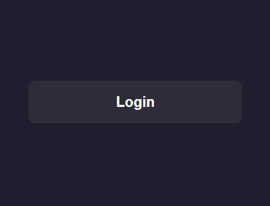
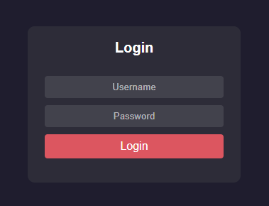

# 🌈 Animated Login Page

### ✨ A Modern, Responsive and Animated Login Page Built Using Pure HTML & CSS


## 📝 Description

**Animated Login Page** is a beautiful, smooth and responsive login page built entirely with **HTML** and **CSS**.
It features stunning background animations, a modern glassmorphism-style UI and an elegant hover effect — **no JavaScript required**.

This project is perfect for:
- 💻 Frontend developers looking to enhance their CSS animation skills
- 🎨 Designers creating stylish login interfaces
- 📁 Web projects that need a minimal, professional login page


## 🚀 Features

- ✅ Fully responsive layout
- ✅ 100% pure HTML & CSS
- ✅ Smooth animations and transitions
- ✅ Lightweight and easy to customize
- ✅ Works on all modern browsers


## 🖼️ Project Screenshot

**Animated Login Page**<br/>
<br/>



## 🧰 Requirements

To view or modify this project, you’ll need:

- 🧭 Any modern web browser (Chrome, Firefox, Edge, Safari)
- 🖋️ A text editor (VS Code, Sublime Text, Atom)
- 🧠 Basic understanding of HTML & CSS


## ⚙️ Installation

You can run this project locally in just a few steps:

```bash
# 1. clone this repository
git clone https://github.com/iamx-ariful-islam/animated-login2.git

# 2. navigate to the project folder
cd animated-login2

# 3. open index.html in your browser
```


## 📂 Folder Structure
Here’s the structure of the **Animated Login Page** project:

```bash
animated-login2/
│
├── screenshots/
├── index.html
├── LICENSE
├── README.md
└── styles.css
```


## Contributing

Pull requests are welcome. For major changes, please open an issue first to discuss what you would like to change.

Please make sure to update tests as appropriate.

## For more or connect with me

<p align='center'>
  <a href="https://github.com/iamx-ariful-islam"></a>&nbsp;&nbsp;&nbsp;&nbsp;
  <a href="https://x.com/mx_ariful_islam"></a>&nbsp;&nbsp;&nbsp;&nbsp;
  <a href="https://bd.linkedin.com/in/iamx-ariful-islam"></a>&nbsp;&nbsp;&nbsp;&nbsp;
  <a href="https://www.facebook.com/jonakisoft.net/"></a>&nbsp;&nbsp;&nbsp;&nbsp;
</p>


## License

The [MIT](https://choosealicense.com/licenses/mit/) License (MIT)


<h2 align="center">💖 Thank You for Visiting!</h2>

<p align="center">
  “Good design is about making things simple yet significant”<br>
  — <a href="https://github.com/iamx-ariful-islam" target="_blank"><strong>Md. Ariful Islam</strong></a>

</p>
